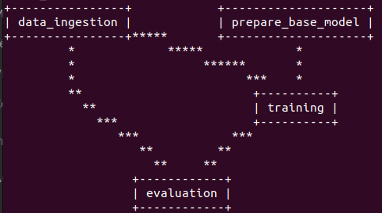

# 🧠 Tumor Detection using MLOps Tools (MLflow, DVC, CICD Pipeline, and Deployment on AWS)

## 🎯 Introduction

The aim of this project is to integrate a tumor detection model using MLOps tools and proper architecture to deploy this model on a production instance. We will also create a Flask application, build a CICD pipeline, and deploy our application on an EC2 AWS instance.

## 💻 Installation

1. Clone the GitHub repository:
    ```bash
    git clone https://github.com/bekkaramohamed/Classification_using_MLflow_and_DVC
    ```

2. Create a virtual environment:
    ```bash
    python -m venv name_of_your_venv
    ```

3. Export the following environment variables:
    ```bash
    export MLFLOW_TRACKING_URI=https://dagshub.com/username/name_of_your_repository.mlflow
    export MLFLOW_TRACKING_USERNAME=username
    export MLFLOW_TRACKING_PASSWORD=dagshub_access_key
    ```

4. Replace the `mlflow_uri` variable in `config > configuration.py` within the `get_evaluation_config` function with your MLflow tracking URI.

5. Set up the `source_URL` variable in the `config.yaml` file with the URL where your data is stored (e.g., Google Drive).

6. Run all the pipelines : 
    ```bash
    python main.py
    ```
7. Run the application:
    ```bash
    python app.py
    ```

## 🏗️ Project Architecture Description

### Workflows

In this project, we have created a template that you can reuse for any machine learning project. The architecture is as follows:

1. **config.yaml**: Configuration and paths to get the output of our pipeline.
2. **Update params.yaml**: Set up parameters for our model.
3. **Update the entity**: Set up the entity to build our pipeline.
4. **Update the configuration manager in src/config**: Set up configuration for each pipeline.
5. **Update the components**: Create components for each stage.
6. **Update the pipeline**: Create the pipeline.
7. **Update the main.py**: Run the entire pipeline.
8. **Update the dvc.yaml**: Set up DVC for pipeline tracking.

## 🛠️ MLflow and DVC Configuration

### MLflow

- **Production Grade**
- **Track all your experiments**
- **Logging & tagging your model**

### DVC

- **Lightweight for POC (Proof of Concept)**
- **Lightweight experiment tracker**
- **Can perform orchestration (creating pipelines)**

### DVC Commands

1. **Initialize DVC**:
    ```bash
    dvc init
    ```

2. **Run the pipeline**:
    ```bash
    dvc repro
    ```

3. **View the pipeline DAG**:
    ```bash
    dvc dag
    ```



### MLFlow

You can use the MLflow UI directly in the terminal to see your experiments locally, but we will view them on DagsHub. Register on [DagsHub](https://dagshub.com/), link your GitHub repository to a DagsHub repository, and set up your environment variables before running the pipeline. After running, view your experiments on DagsHub by navigating to Remote > Experiment > Go to MLFlow UI.

## 🏥 App

Once the pipeline is run, we can run the app to make predictions by uploading a file and getting the results through the prediction pipeline.


## 🚀 AWS CICD Deployment with GitHub Actions

### 1. Login to AWS Console

### 2. Create IAM User for Deployment

1. **EC2 Access**: Virtual machine.
2. **ECR**: Elastic Container Registry to save your Docker image on AWS.

**Description: About the Deployment**

1. Build Docker image of the source code.
2. Push Docker image to ECR.
3. Launch your EC2 instance.
4. Pull your image from ECR on EC2.
5. Launch your Docker image on EC2.

**Policies**:

1. AmazonEC2ContainerRegistryFullAccess
2. AmazonEC2FullAccess

### 3. Create ECR Repo to Store Docker Image

Save the URI: `566373416292.dkr.ecr.us-east-1.amazonaws.com/name_image`

### 4. Create EC2 Machine (Ubuntu)

### 5. Install Docker on EC2 Machine:

**Optional**:
```bash
sudo apt-get update -y
sudo apt-get upgrade

```

**required**:
```bash
curl -fsSL https://get.docker.com -o get-docker.sh
sudo sh get-docker.sh
sudo usermod -aG docker ubuntu
newgrp docker

```
# 6. Configure EC2 as self-hosted runner:
setting>actions>runner>new self hosted runner> choose os> then run command one by one


# 7. Setup github secrets:

    AWS_ACCESS_KEY_ID= key_id

    AWS_SECRET_ACCESS_KEY= secret_key

    AWS_REGION = us-east-1

    AWS_ECR_LOGIN_URI = demo>>  566373416292.dkr.ecr.ap-south-1.amazonaws.com

    ECR_REPOSITORY_NAME = simple-app
